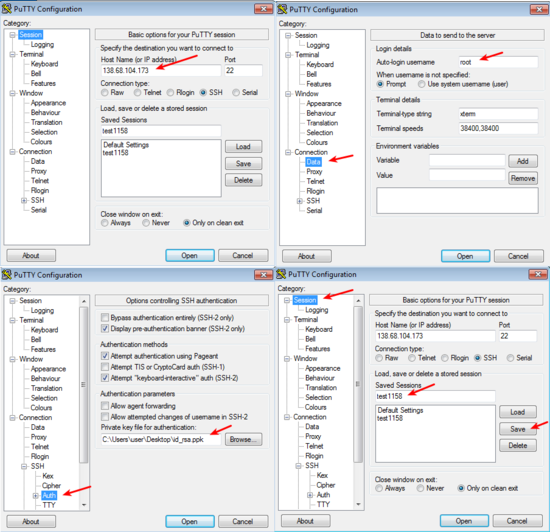
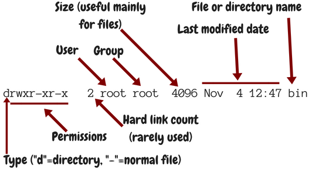

Getting started
===============

Introduction
------------

I want you to understand how Django deployment works, and in order for
you to understand it we'll need to experiment. So you will need an
experimental Debian or Ubuntu server. You could create a virtual machine
on your personal system, but it will be easier and more instructive if
you have a virtual machine on the network. So go to Hetzner, Digital
Ocean, or whatever is your favourite provider, and get a virtual server.
In the rest of this book I will be using $SERVER_IPv4_ADDRESS to denote
the ip address of the server on which your Django project is running; so
you must mentally replace $SERVER_IPv4_ADDRESS with "1.2.3.4" or
whatever the address of your server is. Likewise with
$SERVER_IPv6_ADDRESS, if your server has one.

If you find the above confusing, maybe it's because you don't know what
this book is about.  "Deployment" means installing your Django
application on production. This book doesn't teach you how to develop
with Django; you need to already know that. If you don't, you need to
read another book.

If you are really looking to deploy your Django application, and you can
already create a Debian or Ubuntu server, login to it with ``ssh``, use
``scp`` to copy files, use basic commands like ``ls``, and understand
some basic encryption principles, that is, what is a public and private
key, you can probably skip most of this chapter. Otherwise, I'll take
you step by step, right from getting a virtual server, logging in to it,
and using essential GNU/Linux commands.

Getting a server
----------------

Until recently, I used to create test servers on my laptop using
virtualbox and/or vagrant. However, virtual servers on the cloud have
become so cheap that it is usually better to hire one there. It's faster
to set up, and you don't need to worry about NAT. The other time I
needed a Ubuntu server for a brief test. I created one on DigitalOcean
within a couple of minutes; I made my test; and then I destroyed the
server, after about half an hour. DigitalOcean's charge for that was
$0.01. The cool thing about DigitalOcean is that you can get a test
server for only as long as you need it, and get charged only for the
number of hours for which the server exists. In other providers you
usually pay for the whole month.

(Note: I am not affiliated with DigitalOcean, and I am not using their
referrals program.)

So, if you don't already have a cloud VM provider, sign up on
https://digitalocean.com and create a droplet. DigitalOcean calls its
servers droplets, but they are just virtual machines. In order to create
a droplet, you need to choose the operating system and some other
things.

If you don't want to know much about your options for the operating
system, just choose Ubuntu 16.04 64 bit.

.. tip:: Debian or Ubuntu?

   These two operating systems are practically the same system. You have
   probably already chosen one of the two to work with, and there is no
   reason to reconsider.

   If you haven't chosen yet, and you want to know nothing about this,
   go ahead and pick up the latest LTS version of Ubuntu, which
   currently is 16.04 (and will continue to be so until April 2018).

   The reason I recommend Ubuntu is mostly that it is more popular and
   therefore has better support by virtual server providers. Ubuntu's
   Long Term Support versions also have five years of support instead of
   only three for Debian (though recently Debian has started to offer
   LTS support but it's kind of unofficial). On the other hand I feel
   that Ubuntu sometimes rushes a bit too much to get the latest
   software versions in the operating system release, whereas Debian can
   be more stable; but this is just a feeling, I have no hard data. I
   use Debian, but this is a personal preference because sometimes I'm
   too much of a perfectionist (with deadlines) and I want things my own
   way.

In Ubuntu's version numbering, the first number is the year and the
second is the month; so 16.04 was released in April 2016. The LTS
versions are the ones released in April of even years, so the next LTS
version will be 18.04. I don't see why someone would use the 32-bit
version, which can support only up to 4 GB of RAM, so choose the 64-bit
version. **Don't choose a non-LTS version**; support for these lasts
less than a year, and it is too little.

Besides operating system, you also need to choose size, data center,
IPv6, SSH keys, and host name.

The **size** of the server depends on how heavy the application is. For
our purpose, which is testing Django deployment, the smallest one is
usually more than enough. In fact, 512 MB of RAM and 20 GB of disk space
are sometimes enough for small applications in production.

Choose the **data center** that is nearest to you.

I like my servers to have **IPv6**, so I always turn that on.

Don't specify **SSH keys** yet, unless you are comfortable with them
already. I devote the whole next section to SSH keys.

Finally, choose a **host name**. Usually, when it is for testing, I look
at the time and if it's 17:02 I name the server ``test1702``. For
production, if I don't have anything better, I choose names of Greek
rivers at random.

Hit the big green Create button and your server will be ready after one
or two minutes.  DigitalOcean will create a password for your server and
email it to you.

In order to login from **Unix** (such as Linux or Mac OS X), open a
terminal and type this:

.. code-block:: bash

   ssh root@[server ip address]

The first time you attempt this, it will warn you that the authenticity
of the host cannot be established; tell it "yes", you are sure you want
to continue connecting.  It will then ask for the password. The first
time you connect, it may force you to change the password. Note that
when you type a password, nothing at all is shown, no bullets or other
placeholders, it's as if you are typing nothing, but it is actually
registering your keystrokes.

You can logout of the server by entering ``exit`` at its command prompt.
Ctrl+D also works.

From **Windows** you first need to install an SSH client. The most
popular one is PuTTY, which you can download from http://putty.org/.
It's a single file, ``putty.exe``. Each time you execute it, it will
launch its configuration window. Type the server ip address in the "Host
Name (or IP address)" field and click Open.

The first time you attempt this, it will warn you that the authenticity
of the host cannot be established; tell it Yes, you trust the host.  It
will then ask for the user name ("login as:"), which is ``root``, and
the password. The first time you connect, the server may force you to
change the password. Note that when you type a password, nothing at all
is shown, no bullets or other placeholders, it's as if you are typing
nothing, but it is actually registering your keystrokes.

Eventually you will want to copy and paste text from and to PuTTY. Just
selecting text automatically copies it to the clipboard, and pasting is
just right-clicking.

You can logout of the server by entering ``exit`` at its command prompt.
Ctrl+D also works.

Introduction to SSH keys
------------------------

You have deadlines. Learning about SSH keys doesn't seem to be urgent.
You can live without them, can't you? Is it worth to spend an hour to
learn about them? The answer is yes. If you log on to a server 12 times
per day (a conservative estimate), and it takes on the average 5 seconds
to type your password (and retype it if it's wrong), that's one minute.
You will have paid off your investment in three months. But there are
more savings; when creating a droplet on DigitalOcean you will just be
ticking a box and you will be ready to login. Otherwise you will be
needing to wait for the email to come, copy and paste your password, and
go through the process of changing the password. SSH keys can also be
used on GitHub and other services. Finally, a little understanding of
public key cryptography will later help you setup HTTPS, which is based
on the same principles. So let's start.

You will first create a pair of keys, which we call the public key and
the private key. Let's just do it first. You won't be understanding what
we are doing, but I will explain it afterwards.

On **Unix**, such as Ubuntu or Mac OS X, just enter the command
``ssh-keygen``, which stands for ssh key generator. It will ask you a
couple of questions:

1. It will ask where to store the keys. Since we are just testing, I
   suggest to store them in /tmp/id_rsa.
2. It will ask for a passphrase. For the time being, do not use a
   passphrase. We will come to the passphrase later on.

This will create two files; the private key will be in ``/tmp/id_rsa``,
and the public key in ``/tmp/id_rsa.pub``.

On **Windows**, download ``PuTTYgen`` from the `PuTTY download page`_.
Like ``PuTTY``, ``PuTTYgen`` is a single ``.exe`` file which you
double-click on and it runs.  Click on "Generate". It will ask you to
move the mouse over the blank area; do so. After it finishes, click
"Save private key".  Ignore the warning about having an empty
passphrase, we will deal with that later.  Save the private key to a
file named ``id_rsa.ppk``. Leave the PuTTYgen window open, as we will
need to copy the public key shown at the top, in the field "Public key
for pasting into OpenSSH authorized_keys file".

.. _putty download page: https://www.chiark.greenend.org.uk/~sgtatham/putty/latest.html

In order to login to a server, create a droplet in DigitalOcean. In the
droplet creation form, at the "Add your SSH keys" section, click "New
SSH Key". In the "SSH key content" field, paste the public key. In
**Unix**, the public key is the contents of the file ``id_rsa.pub``; in
**Windows**, it is displayed at the top of the PuTTYgen window. When you
create the droplet, it won't send you any email, as you won't need a
password. The server will be ready for login with your SSH key.

Here is how to logon to the droplet from **Unix**:

.. code-block:: bash

   ssh -i /tmp/id_rsa root@[server_ip_address]

In **Windows**, start PuTTY, and enter the server's IP address at the
"Host Name" field (also look at :numref:`putty_config`). In addition, in
the "Category" tree on the left, go to "Connection", "Data", and in
"Auto-login username" enter "root"; then go to "SSH", "Auth", and in
"Private key file for authentication" specify the ``id_rsa.ppk`` file;
finally, go to "Session", specify a name in "Saved Sessions", and click
"Save".  Finally, click "Open". You should now login on the server
without password.

.. _putty_config:

   How to configure PuTTY

What's more, in the future, if you just open PuTTY and double-click on
the saved session name, you will immediately logon to the server.

How SSH keys work
-----------------

As you noticed, the key generator created a public key and a private
key. These "keys" are just numbers, integers, but large ones; if printed
in decimal, they would be several hundreds of digits long. In order to
save some space, they are stored in the files in a format that is more
condensed than decimal, but the file format does not concern us (in
fact, the private key file contains both keys, so if you lose the public
key file you can generate it from the private key file using ``ssh-keygen
-y`` in Unix or clicking "Load" on PuTTYgen).

These numbers are called keys because they are used in encryption and
decryption. Encryption systems use keys. For example, a silly encryption
system could be to replace a with b, b with c, and so on, so that the
word "chair" becomes "dibjs" and the word "zoo" becomes "app". Or,
instead of moving one letter forward you could move two letters forward,
so "chair" becomes "ejckt" and "zoo" becomes "bqq". In both cases, the
algorithm is the same, but the key changes—in the first example the key
is 1 (we moved one letter forward) and in the second it is 2 (two
letters forward). In that algorithm, the key is a number from 1 to 25.
If you send me an encrypted message with this algorithm and someone
intercepts it, if they know the key with which it was encrypted they can
decrypt it. Of course in this dummy system it's trivial to find the key,
and there are only 25 possible keys anyway, but what I want to
illustrate here is that you need the key in order to decrypt the
message. Serious encryption algorithms like AES are similar to our silly
algorithm with respect to the fact that you decrypt with the same key
that you used to encrypt, which gives them the name "symmetric".

Now, asymmetric, or public key cryptography algorithms, such as RSA,
have the property that keys go in pairs, and if you encrypt a message
with one key, you can only decrypt it with the other key of the pair.
What's more, although there exists a method with which you can generate
pairs of keys, if you know one of the two keys of a pair, you can't
derive the other. At least that's what the mathematicians think. So our
generator, ``ssh-keygen`` or ``PuTTYgen``, generated a pair of two such
numbers.  It christened one of them "public key" and the other "private
key". So now if you want to send me an encrypted message I can just give
you my public key, and it doesn't matter if someone intercepts it. You
can encrypt the secret message with my public key and send it to me, and
it doesn't matter if someone intercepts it. Only I have the
corresponding private key, and only I can decrypt the message.

But how can this be used for authentication? Well, I can take any
message, such as "hello world", and encrypt it with my private key. I
can then send it to you. You have my public key. You can decrypt the
message. Since you were able to decrypt it with my public key, you know
that it was encrypted with my private key. But only I have my private
key, so it was I who encrypted the message. So you know I did it and
no-one else. This is how digital signatures work, and how ssh
authentication works.

So, the server is configured to accept login from you. It knows your
public key. The server asks the ssh client to encrypt some information
with your private key. The ssh client (i.e. ``ssh`` on Unix or PuTTY on
Windows) does so, and sends the encrypted information back to the
server. The server verifies it can be decrypted with your public key,
and then it gives you access.

You configure a server to accept SSH keys simply by adding them to
``/root/.ssh/authorized_keys``, one public key per line. Logon to the
server and examine the contents of the file (``nano`` is the simplest
text editor in GNU/Linux systems):

.. code-block:: bash

   nano /root/.ssh/authorized_keys

You will see that it contains a line with the SSH key you pasted from
``PuTTYgen`` or from the ``id_rsa.pub`` file. That is all the Digital
Ocean UI did, it just added the key to that file. You can specify many
allowed keys in that file, one key per line. ``/root`` is the home
directory of the root user, so the keys specified in
``/root/.ssh/authorized_keys`` may logon as root. If the system has a
user named joe, the home directory of joe is usually ``/home/joe``, and
the keys allowed to logon as joe will be stored in
``/home/joe/.ssh/authorized_keys``.

It's not only people who have SSH keys; SSH servers also have their own
keys. Your server has key pairs in ``/etc/ssh``. It's not only you who
needs to authenticate with the server, but the server also needs to
authenticate with you. You really need to know that you are logging in
to your own server; an attacker could have compromised your local DNS
cache and be directing you towards another server. They could steal
valuable information if they did that, or obtain access to the real
server. This is why, the first time you connect to a server, your SSH
client gives you a warning. The server has provided its public key and
has proven that it has the corresponding private key, but the SSH client
has never connected to this server before, so it has no way of verifying
that that server is really that server. The next times you connect to
that server there will be no warning, because the SSH client can now
verify that it is the same server as the server it connected to the
previous time. On Unix, the ssh client stores server keys in
``$HOME/.ssh/known_hosts``; PuTTY stores them in the registry, in
``HKEY_CURRENT_USER\Software\SimonTatham\PuTTY\SshHostKeys``.

You may have noticed that the warning mentions the "fingerprint" of the
key of the server. It could have just given us the public key, but this
would have been inconvenient because keys are so large. Therefore to
identify keys we use hashes of the keys which we call fingerprints and
are much smaller; they are usually numbers with 32 hexadecimal digits.
While it cannot be ruled out that two different keys might have the same
fingerprint, the probability of this happening is lower than the sky
falling on your head in the next minute, so it's not something you
should worry about.

Using an SSH agent
------------------

Usually you only need a single pair of keys. On **Unix**, we usually
store them at ``$HOME/.ssh/id_rsa`` and ``$HOME/.ssh/id_rsa.pub``.
``ssh-keygen`` by default places them there, and the ssh client, "ssh",
uses them without needing to specify any parameter. On **Windows** there
is no prescribed location, so you should put your ``.ppk`` file wherever
it is convenient.

Now, whoever has your private key can probably format all your servers,
and possibly delete all your software on GitHub. If your laptop is
stolen, they get your key (unless your disk is encrypted). It doesn't
matter if they don't know your boot password or your login password.
Anyone with a screwdriver can reset your BIOS password, and there are
several ways to access a disk when you don't know the login password;
one of the most obvious is to plug the disk on another system. For this
reason, you should encrypt your private key file with a passphrase. You
can either create a new key and not give it an empty passphrase, or you
can change the passphrase of an existing key. You do this with
``ssh-keygen -p -f /tmp/id_rsa`` (you can omit the ``-f /tmp/id_rsa``
part if you want to use the default file, ``$HOME/.ssh/id_rsa``), or by
loading the key in ``PuTTYgen``, specifying a passphrase, and saving it
again.

But it doesn't make any sense to key in the passphrase each time you
want to login to the server. There would be little advantage over typing
the password each time. So what we do is run an "agent", software that
runs continuously in the background, and keeps our unencrypted private
key cached in memory. The ssh client communicates with the agent
whenever needed and gets the key from there. The agent only asks for the
passphrase once after you login to your local machine, and then keeps it
cached until logout or shutdown. This, combined with a screen saver that
locks your screen after a few minutes of inactivity (I use 5 minutes),
is reasonably secure.

On **GNU/Linux**, you don't need to do anything. ``ssh-agent``, as the
agent is called, is installed by default. The first time you attempt to
ssh into the remote server, it will ask you for your passphrase.

On **Windows**, you need to download ``pageant.exe`` from the `PuTTY
download page`_ and set it up to start at login. On Windows 7, you go to
Start, All programs, Startup folder, right-click on the folder and
select "Open", and in there create a new shortcut which should execute
``C:\...\pageant.exe C:\...\your_key.ppk``. After you do that, try to
logout and login (or restart the system altogether), and as soon as you
login pageant will start and ask you for your passphrase.

Finally, on **Mac OS X**, I don't know how it works, but if you search
the web for "Mac OS X ssh-agent" you should find enough information.

Essential GNU/Linux commands
----------------------------

Right after you login, enter this command:

.. code-block:: bash

   pwd

This prints the working directory (also called the current directory),
which right after login is ``/root``, which is equivalent, very roughly,
to ``C:\Users\administrator`` in Windows (which in older Windows
versions was ``C:\Documents¬and¬Settings\administrator``). ``/root`` is
called the "home directory" of the root user. Most other users will have
home directories under ``/home``; for example, if there is user named
joe, the home directory will usually be ``/home/joe``; the root user is
an exception.

In Unix-like operating systems, there is nothing like the drive letters
of Windows. I just plugged a USB storage device on my Debian laptop, and
I can see its files under ``/media/anthony/ANTONIS``. Different storage
devices are thus "mounted" in different locations of the single
directory tree.

Now let's try to view the contents of the directory:

.. code-block:: bash

   ls

"ls" stands for "list" and is the equivalent of the Windows ``dir``
command.  If it didn't show anything, it's because the directory is
empty. If you type ``ls`` on its own, it shows the contents of the current
directory. Try listing the root directory instead:

.. code-block:: bash

   ls /

You can make it list details by adding the ``-l`` parameter:

.. code-block:: bash

   ls -l /

In that case, the output is like :numref:`output_of_ls`.

.. _output_of_ls:

   Output of ``ls``

Usually when we use ``-l`` we also use ``-h``, which shows prettier
numbers; for example, instead of 4096 it shows 4.0K. You can type either
``ls -l -h``, or, as is more common, ``ls -lh``.

Just as in Windows, you can change directory using the ``cd`` command:

.. code-block:: bash

   cd /
   pwd

In contrast to Windows, ``cd`` on its own takes you to the home
directory, so for the root user, a mere ``cd`` is equivalent to ``cd
/root``. The Unix-like equivalent of a mere ``cd`` in Windows is the
``pwd`` command.

Just a while ago, we tried ``ls`` on the ``/root`` directory. We are
interested in some files that happen to be hidden. In Unix, when a file
begins with a dot, it's "hidden". This means that ``ls`` doesn't
normally show it, and that when you use wildcards such as * to denote
all files, the shell will not include it. Otherwise it's not different
from non-hidden files.  To list the contents of a directory including
hidden files, use the ``-a`` option:

.. code-block:: bash

   ls -a

This will include ``.`` and ``..``, which denote the directory itself
and the parent directory (``/root/.`` is the same as ``/root``;
``/root/..`` is the same as ``/``). You can use ``-A`` instead of ``-a``
to list all hidden files except ``.`` and ``..``.

The last command we will examine in this section is ``shutdown``. To
restart a machine, enter ``shutdown -r now``. You can also shut down a
system with ``shutdown -h now``, but this much is less often used on
servers.

Shell files, editing files, remote copying
------------------------------------------

After the ssh server authenticates you and decides to give you access,
it runs your shell. The shell is the program that accepts input from
you, parses it, and executes the commands you type. There is a number of
shells you can choose from, but most probably you are using the most
popular, which is called "bash". Bash stores the commands you type in
``.bash_history``; when at the shell prompt you use the arrow up/down
keys to move through your history of commands, bash gets this history
from the file.

When you login, bash executes the commands in ``.profile``; and when you
logout, it executes the commands in ``.bash_logout``. Finally, each time
an interactive shell starts, it executes the commands in ``.bashrc``.
The difference between ``.bashrc`` and ``.profile`` is that the latter
is executed only by a "login shell"; that is, by the shell started by
the ssh server as soon as you login; but if you start another shell,
e.g. by entering ``bash``, only ``.bashrc`` is executed. Type this:

.. code-block:: bash

   bash
   exit

The first command starts another bash that runs inside the bash you were
running before. The second command exits from the nested bash and
returns you to the previous bash. Of course you would normally not do
something like this, but it demonstrates that the "outside" shell is
probably your login shell, whereas the "inside" shell is another
interactive shell. When the nested one starts, it executes ``.bashrc``.

Now, let's edit ``.bashrc``.

.. code-block:: bash

   nano .bashrc

We have already seen ``nano`` before—it's the simplest editor in
GNU/Linux systems like Debian and Ubuntu. Many people prefer to use
``vim`` or ``emacs``, which are very powerful but need some learning.
``nano`` is as simple as Windows Notepad, but it does not need a GUI. At
the bottom it shows you what the special keys do; for example, ^X
(Ctrl+X) exits the editor.

I like the bash prompt to be colored. To use the same colors I use, add
this snippet at the end of the .bashrc file::

   red=$(tput setaf 1)
   green=$(tput setaf 2)
   blue=$(tput setaf 4)
   reset=$(tput sgr0)
   PS1='\[$red\]\u\[$reset\]@\[$green\]\h\[$reset\]:\[$blue\]\W\[$reset\]\$ '

Now exit ``nano`` by saving the file, logout and login again, and the
prompt should be colored. I'm not going to explain how these commands
work, as they are quite complicated; my main purpose here was for you to
get a grip with editing a file and see the results.

If you have custom stuff in your ``.bashrc``, you won't want to login to
the server, edit ``.bashrc``, make the changes, save, logout, and login
again, and all that each time you create a new virtual server. Instead,
you will want to keep your custom ``.bashrc`` somewhere in your local
machine and copy it to the new virtual server. If your local machine
runs GNU/Linux, you can use the ``scp`` command:

.. code-block:: bash

   scp .bashrc root@1.2.3.4:/root/

If you have Windows, download ``pscp.exe`` from the PuTTY download page,
make sure it's in the system path, and run it from a command prompt or
PowerShell like this:

.. code-block:: bash

   pscp .bashrc root@1.2.3.4:/root/

The command means "open an ssh connection to machine 1.2.3.4, login as
root, and using the ssh connection transfer the file ``.bashrc`` from
the local machine to the remote, and put it in  ``/root/``". It uses the
ssh keys stored in ``.ssh`` or in PuTTY, so it can login without a
password.  Instead of ``.bashrc`` you could have used a full or relative
path such as ``/home/anthony/.bashrc`` or ``C:\Users\user\.bashrc``.
Instead of ``root@1.2.3.4:/root/`` you could have simply used
``root@1.2.3.4:`` (don't forget the colon at the end); if you don't
specify a destination, the remote user's home directory is the default.
Copying also works the other way round; ``scp root@1.2.3.4:.bashrc .``
would fetch the remote file ``/root/.bashrc`` locally and put it in the
current directory.

Installing software on a Debian/Ubuntu server
---------------------------------------------

If you want to install nginx or any other software on Windows, you need
to go to the software's web site, download it, and execute the
downloaded installer. In Debian and Ubuntu we rarely do something like
this. To install nginx, just enter this command:

.. code-block:: bash

   apt install nginx

``apt`` is the Advanced Package Tool. Except for "install" it also has
"remove", with which you can uninstall, and some other options. You will
find out that people mostly use ``apt-get`` instead of ``apt``, which is
also correct. ``apt`` actually uses ``apt-get`` behind the scenes.

What actually happens is that the Debian/Ubuntu developers have packaged
nginx so that it can be installed with ``apt``. They have done this with
thousands of software items, so whenever you want to install something
on your server, chances are it's packaged. This is true for other
GNU/Linux systems as well, though they usually use different package
managers. CentOS uses ``rpm``, for example.

``apt`` keeps a list of available packages. This needs to be updated
regularly, because it changes whenever there are security updates. Try
this to update the list:

.. code-block:: bash

   apt update

After you update the list, you also need to upgrade any installed packages:

.. code-block:: bash

   apt upgrade

After creating a new server, pretty much the first thing you should do
is to update the list and upgrade the software. The two commands can be
joined into a single one like this:

.. code-block:: bash

   apt update && apt -y upgrade

This idiom means "run ``apt update``, and if it succeeds, run ``apt -y
upgrade``". The ``-y`` option tells apt to not ask you "Do you want to
continue?", but instead assume yes.

In contrast to Windows, which installs updates automatically,
Debian/Ubuntu servers don't, unless you install package
``unattended-upgrades``. However, I don't recommend it. I think it's a
bad idea to run unattended upgrades, and I've once seen a server stop
working when it was performing unattended upgrades and the upgrade
procedure needed to ask a question. We found out the next morning. What
I do is that I am subscribed to the `Debian Security Announce`_ mailing
list, so whenever there's a problem I get notified and I run ``apt
update && apt -y upgrade``. I'm using Debian on all my servers; if you
use Ubuntu, you should subscribe to the `Ubuntu Security Announce`_ list
instead.

.. _debian security announce: https://lists.debian.org/debian-security-announce/
.. _ubuntu security announce: https://lists.ubuntu.com/mailman/listinfo/ubuntu-security-announce

This applies only to software installed with ``apt``. If you install
software in any other way, ``apt`` will not upgrade it, and the
Debian/Ubuntu security announce mailing lists will not mention it. The
most common other way that you will use to install software is ``pip``.
You will probably install Django with ``pip``, and you should be
monitoring the `Django blog`_ for security announcements (you can
`subscribe to its feed`_, for example).

.. _django blog: https://www.djangoproject.com/weblog/
.. _subscribe to its feed: https://www.djangoproject.com/rss/weblog/

Sometimes you will not know how a package is named. Suppose you want to
install Apache. You immediately suspect that Apache may be packaged, but
you don't know the name of the package. Here is how to search for
Apache:

.. code-block:: bash

   apt-cache search apache

(``apt search apache`` also works, but ``apt-cache search`` is faster
and I like better the formatting of the results.) On a Ubuntu 16.04
system, this returns about 735 results. If you only want to search for
packages that have "apache" in their name (and not just in their
description or elsewhere), you can do this:

.. code-block:: bash

   apt-cache search --names-only apache

This returns 161. Still many. You can narrow it down by searching only
for packages whose name begins with "apache":

.. code-block:: bash

   apt-cache search --names-only ^apache

This returns only 12 packages. The first one, ``apache2``, is probably
what you want. You can examine the contents of the package thus:

.. code-block:: bash

   apt show apache2

There are more ways to narrow down the search, as there are tens of
thousands of packages, but I think that's enough for now.

Reading the documentation
-------------------------

In the preceding sections, we saw that ``ls`` can accept several
options, such as ``-l``, ``-h``, ``-a``, ``-A``, and others, and that
``apt-cache search`` accepts the ``--names-only`` option. Where can you
find a reference of the options used?

The answer depends on the tool. Traditionally we use the ``man`` command
for this; for example,

.. code-block:: bash

   man apt-cache

will show you the full documentation of ``apt-cache``.

In 1990 we were still reading the documentation from printed manuals,
and ``man ls`` would show you the contents of the printed manual's
``ls`` entry. "man" stands for manual. At that time, that system was
quite cool. If you wanted to take a quick glance at a detail in the
manual you'd use the ``man`` command which was quicker, but if you
wanted to study the manual more carefully you'd prefer to use the
printed version which was easier to read. Remember, there was no web at
that time, and terminals weren't as smart as they are today (there was
no bold or italics when you used the ``man`` command).

When the GNU system was developed at around that time, its developers
thought that the ``man`` system was outdated, and they developed
``info``.  Although this is a better system that uses hyperlinks, it
didn't get much traction, so today it's not much used. You can access
the full documentation for ``ls`` with ``info ls``, but this works much
better from within the emacs editor than with the standalone ``info``
program, and it takes some learning. I never use ``info``; I usually
just use ``man ls``, which is a summary that has most of the information
I need, and if I need more I usually search the web.

Finally, it has lately become fashionable for commands to show help when
given the ``--help`` option. Usually the help provided with ``--help``
is more condensed than that provided by ``man`` or ``info``. ``ls`` has
all three; ``info``, ``man``, and ``--help``.

The quality of the documentation varies. While sometimes the help
provided by ``man`` is excellent and can be used as tutorial as well as
reference, very often it is better to familiarize yourself with a
program by reading a book or a tutorial on the web. For example, you
can't possibly learn ``git`` from its official documentation (and you
can barely use it as reference).

.. _setting_up_the_system_locale:

Setting up the system locale
----------------------------

The "locale" is the regional settings, among which the character
encoding used.  If the character encoding isn't correctly set to UTF-8,
sooner or later you will run into problems. So checking the system
locale is pretty much the first thing you should do on a new server.

The procedure is this:

1. Open the file ``/etc/locale.gen`` in an editor and make sure the
   line that begins with "en_US.UTF-8" is uncommented.
2. Enter the command ``locale-gen``; this will (re)generate the
   locales.
3. Open the file ``/etc/default/locale`` in an editor, and make sure it
   contains the line ``LANG=en_US.UTF-8``. Changes in this file require
   logout and login to take effect.

Let me now explain what all this is about. The locale consists of a
language, a country, and a character encoding; "en_US.UTF-8" means
English, United States, UTF-8. This tells programs to show messages in
American English; to format items such as dates in the way it's done in
the United States; and to use encoding UTF-8.

Different users can be using different locales. If you have a desktop
computer used by you and your spouse, one could be using English and the
other French. Each user does this by setting the ``LANG`` environment
variable to the desired locale; if not, the default system locale is
used for that user. For servers this feature is less important. While
your Django application may display the user interface in different
languages (and format dates and numbers in different ways), this is done
by Django itself using Django's internationalization and localization
machinery and has nothing to do with what we are discussing here, which
affects mostly the programs you type in the command line, such as
``ls``. Because for servers the feature of users specifying their
preferred locale isn't so important, we usually merely use the default
system locale, which is specified in the file ``/etc/default/locale``.
You can understand English, otherwise you wouldn't be reading this book,
so "en_US.UTF-8" is fine. If you prefer to use another country, such as
"en_UK.UTF-8", it's also fine, but it's no big deal, as I will explain
later on.

Although the system can support a large number of locales, many of these
are turned off in order to save a little disk space. You turn them on by
adding or uncommenting them in file ``/etc/locale.gen``. When you
execute the program ``locale-gen``, it reads ``/etc/locale.gen`` and
determines which locales are activated, and it compiles these locales
from their source files, which are relatively small, to some binary
files that are those actually used by the various programs. We say that
the locales are "generated". If you activate all locales the binary
files will be a little bit over 100 M, so the saving is not that big (it
was important 15 years ago); however they will take quite some time to
generate. Usually we only activate a few.

To check that everything is right, do this:

1. Enter the command ``locale``; everything (except, possibly,
   ``LANGUAGE`` and ``LC_ALL``) should have the value "en_US.UTF-8".
2. Enter the command ``perl -e ''``; it should do nothing and give no
   message.

The ``locale`` command merely lists the active locale parameters.
``LC_CTYPE``, ``LC_NUMERIC`` etc. are called "locale categories", and
usually they are all set to the same value. In some edge cases they
might be set to different values; for example, on my laptop I use
"en_US.UTF-8", but especially for ``LC_TIME`` I use "en_DK.UTF-8", which
causes Thunderbird to display dates in ISO 8601. This is not our concern
here and it rarely is on a server. So we don't set any of these
variables, and they all get their value from ``LANG``, which is set by
``/etc/default/locale``.

However, sometimes you might make an error; you might specify a locale
in ``/etc/default/locale``, but you might forget to generate it. In that
case, the ``locale`` command will indicate that the locale is active,
but it will not show that anything is wrong. This is the reason I run
``perl -e ''``.  Perl is a programming language, like Python. The
command ``perl -e ''``, does nothing; it tells Perl to execute an empty
program; same thing as ``python -c ''``. However, if there is anything
wrong with the locale, Perl throws a big warning message; so ``perl -e
''`` is my favourite way of verifying that my locale works. Try, for
example, ``LANG=el_GR.UTF-8 perl -e ''`` to see the warning message.  So
``locale`` shows you which is the active locale, and ``perl -e ''``, if
silent, indicates that the active locale has been generated and is
valid.

I told you a short while ago that the country doesn't matter much for
servers. Neither does the language. What matters is the encoding. You
want to be able to manipulate all characters of all languages. Even if
all your customers are English speaking, there may eventually be some
remark about a Chinese character in a description field. Even if you are
certain there won't, it doesn't make any sense to constrain yourself to
an encoding that can represent only a subset of characters when it's
equally easy to use UTF-8. So you need to make sure you use UTF-8. In
the chapter about PostgreSQL we will see that installing PostgreSQL is a
process particularly sensitive to the system locale settings.

The programs you run at the command line will be producing output in
your chosen encoding. Your terminal reads the bytes produced by these
programs and must be able to decode them properly, so it must know how
they are encoded. In other words, you must set your terminal to UTF-8 as
well.  Most terminals, including PuTTY and gnome-terminal, are by
default set to UTF-8, but you can change that in their preferences.

Quickly starting Django on a server
-----------------------------------

As I said in the beginning, we will be experimenting. Experimenting
means we will be trying things. We will be installing your Django
project and do things with it, and then we will be deleting it and
reinstalling it to try things differently as we move on. You must have
mastered setting up a development server from scratch. You should be
able to setup your Django project on a newly installed machine within a
couple of minutes at most, with a sequence of commands similar to the
following:

.. code-block:: bash

   apt install git python3 virtualenvwrapper
   git clone $DJANGO_PROJECT_REPOSITORY
   cd $DJANGO_PROJECT
   mkvirtualenv --system-site-packages $DJANGO_PROJECT
   pip install -r requirements.txt
   python3 manage.py migrate
   python3 manage.py runserver

It doesn't matter if you use Python 2 instead of 3, or ``mercurial`` (or
even, horrors, FTP) instead of ``git``, or plain ``virtualenv`` instead
of virtualenvwrapper, or if you don't use ``--system-site-packages``.
What *is* important is that you have a grip on a sequence of commands
similar to the above and get your development server running in one
minute. We will be using ``virtualenv`` heavily; if you aren't
comfortable with ``virtualenv``, read `my blog post on virtualenv`_.

So, you have your virtual server, and you have a sequence of commands
that can install a Django development server for your project.  Go ahead
and do so on the virtual server. Do it as the root user, in the
``/root`` directory.

Now, make sure you have this in your settings::

   DEBUG = True
   ALLOWED_HOSTS = ['$SERVER_IPv4_ADDRESS']

Then, instead of running the development server with
``./manage.py runserver`` run it as follows:

.. code-block:: bash

    ./manage.py runserver 0.0.0.0:8000

After it starts, go to your web browser and tell it to go to
http://$SERVER_IPv4_ADDRESS:8000/. You should see your Django project in
action.

Usually you run the Django development server with ``./manage.py
runserver``, which is short for ``./manage.py runserver 8000``. This
tells the Django development server to listen for connections on port
8000. However, if you just specify "8000", it only listens for local
connections; a web browser running on the server machine itself will be
able to access the Django development server at
"http://localhost:8000/", but remote connections, from another machine,
won't work. We use "0.0.0.0:8000" instead, which asks the Django
development server to listen for remote network connections. Even
better, if your virtual server has IPv6 enabled, you can use this:

.. code-block:: bash

    ./manage.py runserver [::]:8000

This will cause Django to listen for remote connections on port 8000,
both for IPv4 and IPv6.

Next problem is that you can't possibly ask your users to use
http://$SERVER_IPv4_ADDRESS:8000/. You have to use a domain name, and,
you have to get rid of the ":8000" part. Let's deal with the ":8000"
first.  "http://$SERVER_IPv4_ADDRESS/" is actually a synonym for
"http://$SERVER_IPv4_ADDRESS:80/", so we need to tell Django to listen
on port 80 instead of 8000. This may or may not work:

.. code-block:: bash

    ./manage.py runserver 0.0.0.0:80

Port 80 is privileged. This means that normal users aren't allowed to
listen for connections on port 80; only the root user is. So if you run
the above command as as a normal user, Django will probably tell you
that you don't have permission to access that port.  If you run the
above command as root, it should work.  If it tells you that the port is
already in use, it probably means that a web server such as Apache or
nginx is already running on the machine. Shut it down:

.. code-block:: bash

    service apache2 stop
    service nginx stop

When you finally get ``./manage.py runserver 0.0.0.0:80`` running, you
should, at last, be able to go to your web browser and reach your Django
project via http://$SERVER_IPv4_ADDRESS/. Congratulations!

Things we need to fix
---------------------

Now, of course, this is the wrong way to do it. It's wrong for the
following reasons:

* The URL http://$SERVER_IPv4_ADDRESS/ is ugly; you need to use a
  domain name.
* You have put your project in ``/root``.
* You are running Django as root.
* You have Django serve your static files, and you have DEBUG=True.
* You are using ``runserver``, which is seriously suboptimal and only
  meant for development.
* You are using SQLite.

Let's go fix them.

.. _my blog post on virtualenv: http://djangodeployment.com/2016/11/01/virtualenv-demystified/

