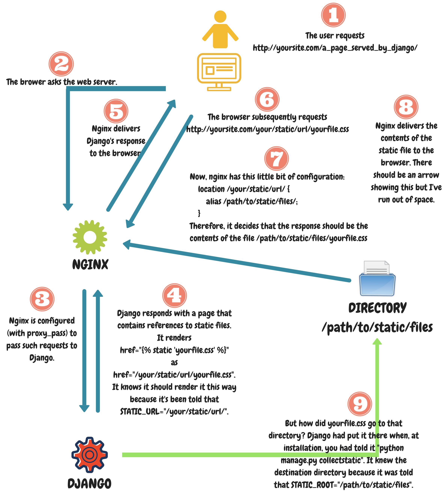
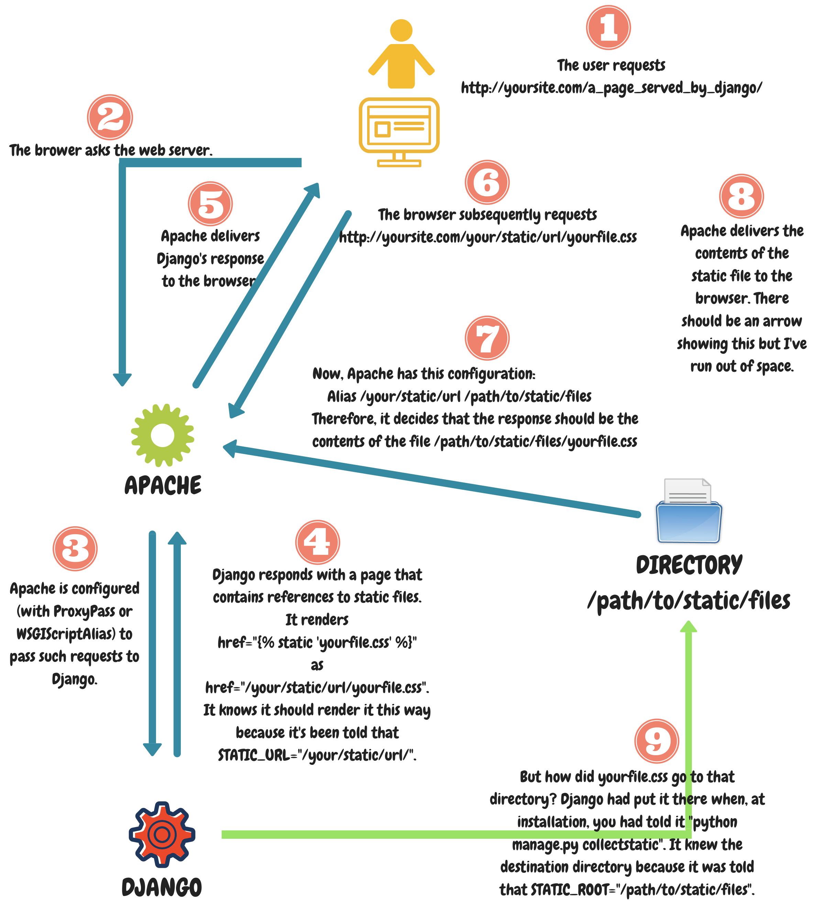

Static and media files
======================

Let's quickly make static files work. You might not understand perfectly
what we're doing, but it will become very clear afterwards.

Setting up Django
-----------------

**First**, add these statements to
``/etc/opt/$DJANGO_PROJECT/settings.py``::

   STATIC_ROOT = '/var/cache/$DJANGO_PROJECT/static/'
   STATIC_URL = '/static/'

Remember that after each change to your settings you need to recompile:

.. code-block:: bash

   /opt/$DJANGO_PROJECT/venv/bin/python -m compileall \
       /etc/opt/$DJANGO_PROJECT

**Second**, create directory ``/var/cache/$DJANGO_PROJECT/static/``:

.. code-block:: bash

   mkdir -p /var/cache/$DJANGO_PROJECT/static

The ``-p`` parameter tells ``mkdir`` to create the directory and its
parents.

**Third**, run ``collectstatic``:

.. code-block:: bash

   PYTHONPATH=/etc/opt/$DJANGO_PROJECT:/opt/$DJANGO_PROJECT \
       /opt/$DJANGO_PROJECT/venv/bin/python \
       /opt/$DJANGO_PROJECT/manage.py collectstatic \
       --settings=settings

This will copy all static files to the directory we specified in
`STATIC_ROOT`. Don't worry if you don't understand it clearly, we will
explain it in a minute.

Setting up nginx
----------------

Change ``/etc/nginx/sites-available/$DOMAIN`` to the following,
which only differs from the previous version in that the new ``location
/static {}`` block has been added at the end:

.. code-block:: nginx

    server {
        listen 80;
        listen [::]:80;
        server_name $DOMAIN www.$DOMAIN;
        root /var/www/$DOMAIN;
        location / {
            proxy_pass http://localhost:8000;
            proxy_set_header Host $http_host;
            proxy_redirect off;
            proxy_set_header X-Forwarded-For $remote_addr;
            proxy_set_header X-Forwarded-Proto $scheme;
            client_max_body_size 20m;
        }
        location /static/ {
            alias /var/cache/$DJANGO_PROJECT/static/;
        }
    }

Don't forget to execute ``service nginx reload`` after that.

Now let's try to see if it works. **Stop the Django development server**
if it is running on the server. Open your browser and visit
http://$DOMAIN/. nginx should give you a 502. This is expected, since
the backend is not working.

But now try to visit http://$DOMAIN/static/admin/img/icon_searchbox.png.
If you have ``django.contrib.admin`` in ``INSTALLED_APPS``, it should
get a search icon (if you don't use ``django.contrib.admin``, pick up
another static file that you expect to see, or browse the directory
``/var/cache/$DJANGO_PROJECT/static``).

.. only:: latex

   The figure in the next page explains how this works. Go study it now,
   and after everything is clear, come back here.

.. only:: html

   This picture explains how it works:

The only thing that remains to clear up is what exactly these
``location`` blocks mean. ``location /static/`` means that the
configuration inside the block shall apply only if the path of the URL
begins with ``/static/``.  Likewise, ``location /`` applies if the path
of the URL begins with a slash.  However, all paths begin with a slash,
so if the path begins with ``/static/`` both ``location`` blocks match
the URL.  Nginx only uses one ``location`` block. The rules with which
nginx chooses the ``location`` block that shall apply are complicated
and are described in the `documentation for location`_, but in this
particular case, nginx chooses the longest matching prefix; so if the
path begins with ``/static/``, nginx will choose ``location /static/``.

.. _documentation for location: http://nginx.org/en/docs/http/ngx_http_core_module.html#location

Setting up Apache
-----------------

Change ``/etc/apache2/sites-available/$DOMAIN.conf`` to the following:

.. code-block:: apache

   <VirtualHost *:80>
       ServerName $DOMAIN
       ServerAlias www.$DOMAIN
       DocumentRoot /var/www/$DOMAIN
       ProxyPass /static/ !
       ProxyPass / http://localhost:8000/
       ProxyPreserveHost On
       RequestHeader set X-Forwarded-Proto "http"
       Alias /static/ /var/cache/$DJANGO_PROJECT/static/
       <Directory /var/cache/$DJANGO_PROJECT/static/>
           Require all granted
       </Directory>
   </VirtualHost>

Don't forget to execute ``service apache2 reload`` after that.

Now let's try to see if it works. **Stop the Django development server**
if it is running on the server. Open your browser and visit
http://$DOMAIN/. Apache should give you a 503. This is expected, since
the backend is not working.

But now try to visit http://$DOMAIN/static/admin/img/icon_searchbox.png.
If you have ``django.contrib.admin`` in ``INSTALLED_APPS``, it should
get a search icon (if you don't use ``django.contrib.admin``, pick up
another static file that you expect to see, or browse the directory
``/var/cache/$DJANGO_PROJECT/static``).

.. only:: latex

   The figure in the next page explains how this works. Go study it now,
   and after everything is clear, come back here.

.. only:: html

   This picture explains how it works:

Now let's examine how the configuration above produces these results.
The directive ``ProxyPass / http://localhost:8000/`` tells Apache that,
if the URL path begins with ``/``, then it should pass the request to
the backend. All URL paths begin with ``/``, so the directive always
matches. But there is also the directive ``ProxyPass /static/ !``, which
will match paths starting with ``/static/``. When there are many
matching ``ProxyPass`` directives, the first one wins; so for path
``/static/admin/img/icon_searchbox.png``, ``ProxyPass /static/ !`` wins.
The exclamation mark means "no proxy passing", so the directive means
"when a URL path begins with ``/static/``, do not pass it to the
backend". Since it is not going to passed to the backend, Apache would
normally combine it with the ``DocumentRoot`` and would thus try to
return the file
``/var/www/$DOMAIN/static/admin/img/icon_searchbox.png``, but the
``Alias`` directive tells it to get
``/var/cache/$DJANGO_PROJECT/static/admin/img/icon_searchbox.png``
instead. By default, Apache will refuse to access files in directories
other than ``DocumentRoot``, and will return 403, "Forbidden", in
requests to access them; so we add the directive ``Require all granted``
for the static files directory, which means "everyone has permission to
read the files".

Media files
-----------

Media files are similar to static files, so let's go through them
quickly. We will store them in ``/var/opt/$DJANGO_PROJECT/media``.

.. code-block:: bash

   mkdir /var/opt/$DJANGO_PROJECT/media
   chown $DJANGO_USER /var/opt/$DJANGO_PROJECT/media

Add the following to ``/etc/opt/$DJANGO_PROJECT/settings.py``::

   MEDIA_ROOT = '/var/opt/$DJANGO_PROJECT/media/'
   MEDIA_URL = '/media/'

For nginx, add the following to ``/etc/nginx/sites-available/$DOMAIN``:

.. code-block:: nginx

   location /media/ {
       alias /var/opt/$DJANGO_PROJECT/media/;
   }

For Apache, add the following before ``ProxyPass /``:

.. code-block:: apache

   ProxyPass /media/ !

and the following at the end of the ``VirtualHost`` block:

.. code-block:: apache

   Alias /media/ /var/opt/$DJANGO_PROJECT/media/
   <Directory /var/opt/$DJANGO_PROJECT/media/>
       Require all granted
   </Directory>

Recompile your settings, change the group of the compiled file, reload
the web server, and it's ready.

One of the differences with static files is that we changed the
ownership of ``/var/opt/$DJANGO_PROJECT/media`` to $DJANGO_USER.
The reason is that Django needs to be able to be writing there each time
the user uploads a file, or each time the user asks to delete a file.

File locations
--------------

Your static and media files are now served properly by the web server
instead of the Django development server, and I hope you understand
clearly what we've done. Let's take a break and discuss the file
locations that I've chosen, which are the following:

============== =========================================
Program files  /opt/$DJANGO_PROJECT           
Virtualenv     /opt/$DJANGO_PROJECT/venv
Media files    /var/opt/$DJANGO_PROJECT/media     
Static files   /var/cache/$DJANGO_PROJECT/static        
Configuration  /etc/opt/$DJANGO_PROJECT                     
============== =========================================

There are a couple more that we haven't seen yet, but the above more or
less tell the whole story.

Many people prefer a much simpler setup instead. They put everything
related to their project in a single directory, which is that of their
repository root, like this:

============== ====================================
Program files  /srv/$DJANGO_PROJECT           
Virtualenv     /srv/$DJANGO_PROJECT/venv
Media files    /srv/$DJANGO_PROJECT/media     
Static files   /srv/$DJANGO_PROJECT/static        
Configuration  /srv/$DJANGO_PROJECT/$DJANGO_PROJECT
============== ====================================

Since ``/srv/$DJANGO_PROJECT`` is the root of the repository working
directory, they add ``media`` and ``static`` to ``.gitignore``.

Although this setup seems simpler, I have preferred the other one for
several reasons. The first one is purely educational. When you get too
used to the simple setup, you might configure always the same
``STATIC_ROOT``, without really understanding what it does. The clean
separation of directories should also have helped you get a grip on
``PYTHONPATH`` and ``DJANGO_SETTINGS_MODULE``. I hope you now understand
them clearly and not just mechanically copying and pasting them from
examples with only a vague idea of how they are supposed to work.

Separating in many directories is also cleaner and applies in many
different situations. We have assumed so far that your $DJANGO_PROJECT
is a repository which you can clone or copy somewhere, but what if you
turn your project into a reusable pip-installable application? In that
case there will be no ``/srv/$DJANGO_PROJECT`` or
``/opt/$DJANGO_PROJECT``. The tweak required with the split
directories scheme is minimal. Likewise if you package your application
into a ``.deb`` package.

Finally, separating the directories makes it easier to backup only what
is needed. My backup script (which we will see in Chapter 8)
automatically excludes ``/opt`` and ``/var/cache`` from the backup.
Since the static files can be regenerated, there is no need to back them
up.

Chapter summary
---------------

 * Set ``STATIC_ROOT`` to ``/var/cache/$DJANGO_PROJECT/static/``.
 * Set ``STATIC_URL`` to ``/static/``.
 * Set ``MEDIA_ROOT`` to ``/var/opt/$DJANGO_PROJECT/media/``.
 * Set ``MEDIA_URL`` to ``/media/``.
 * Run ``collectstatic``.
 * In nginx, set ``location /static/ { alias
   /var/cache/$DJANGO_PROJECT/static/; }``; likewise for media files.
 * In Apache, add ``ProxyPass /static/ !`` before ``ProxyPass /``, and
   add

   .. code-block:: apache

       Alias /static/ /var/cache/$DJANGO_PROJECT/static/
       <Directory /var/cache/$DJANGO_PROJECT/static/>
           Require all granted
       </Directory>

   Likewise for media files.
